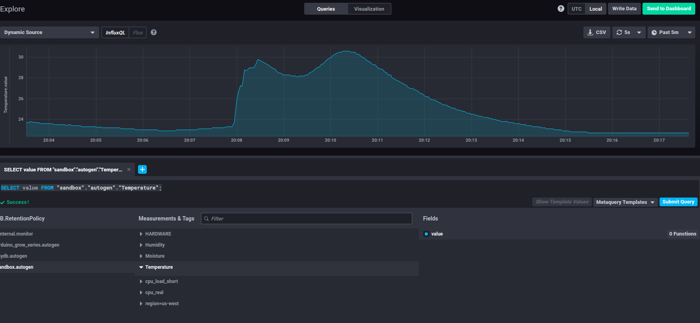

# arudino_playground
Arduino playground for our team

## Influx db queries
SELECT value FROM "sandbox"."autogen"."Temperature";

## Shishaino

Data from different sources of temperature
### Inside
* Temperature:120.25 ℃
* Temperature:120.25 ℃
* Temperature:120.50 ℃
* Temperature:120.50 ℃
* Temperature:120.50 ℃
* Temperature:120.50 ℃
* Temperature:120.50 ℃
* Temperature:120.50 ℃
* Temperature:120.75 ℃

### Outside
* Temperature:80.50 ℃
* Temperature:80.75 ℃
* Temperature:81.00 ℃
* Temperature:80.75 ℃
* Temperature:81.00 ℃
* Temperature:80.50 ℃
* Temperature:80.50 ℃
